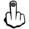
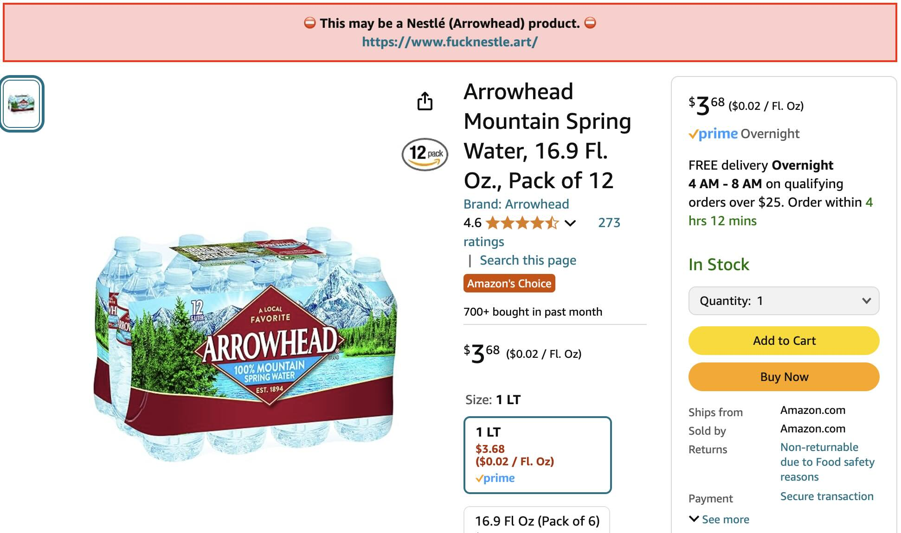

# Fuck Nestlé Chrome Extension

This extension warns you before buying a product from one of Nestlé's many brands. Nestlé's business practices destroy lives, destabilize communities, and threaten our shared environment.

## "Supported" Sites

- Amazon.com
- Instacart.com
- Target.com
- WalMart.com

<picture>
  
</picture>

_"A local favorite" in that locals want Nestlé to [stop ignoring court orders to cease stealing water](https://www.latimes.com/environment/story/2024-08-07/arrowhead-bottled-water-permit)._

## How to Install

1. [Click here](https://github.com/hbmartin/chrome-extension-fuck-nestle/archive/refs/heads/main.zip) to download this Chrome extension.
2. Open the downloaded zip file.
3. Go to chrome://extensions (copy and paste into URL bar).
4. Enable `Developer mode` by toggling the switch in the top right corner.
5. Click on `Load unpacked` button in the upper left.
6. Select the `chrome-extension-fuck-nestle-main` unzipped directory from step #2.

Please report any missing brands, other retailers to war on, or any other issues [here](https://github.com/hbmartin/chrome-extension-fuck-nestle/issues)

## Attribution

Brand list sourced from [https://www.fucknestle.art/](https://www.fucknestle.art/) and the BlueTriton site. Many thanks to [Zach Jordan](https://www.zachjordan.io/).

This project is not endorsed by or formally affiliated with FN or ZJ.